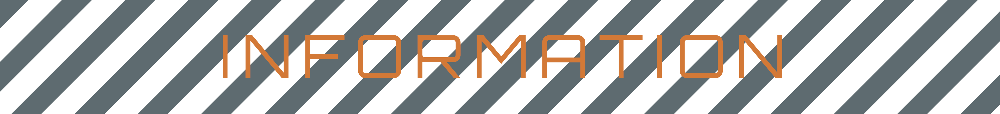

 

<!-- MOD INFO -->

  

# Source/
> Contents originate from `Source/` folder ignored by `config` mod. This branch retains the original and unbaked 3D assets (such as textures in `.tga` format, or, models in `.fbx` format) used in this mod. It is intended to be set to ***read-only***.

TBD