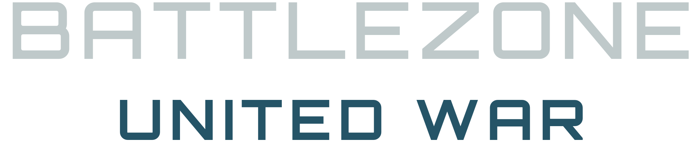
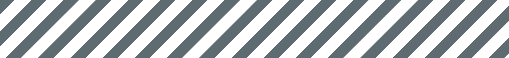

 

<!-- DESCRIPTION -->

  
    
  
  <!--<h3 align="center">UNITED WAR</h3>-->

<h6 align="center">This mod is a work-in-progress. Contents of this repository are subject to change.</h6>
 

<!-- STATS -->

    
    
    <!--<a href='https://github.com/LordBramster/BZCC-United-War-Mod/releases'>-->
  <a href='https://github.com/LordBramster/BZCC-United-War-Mod/releases'>
     

<h6 align="center">
Following the events of BATTLEZONE 2, the UNITED WAR story begins many years after the end of the Human-Scion War. By 2097, the INTERNATIONAL SPACE DEFENSE FORCE was disbanded; an all new peacekeeping force known as the UNITED DEFENSE FORCE, safeguards the new "solar frontier". RACHAEL MANSON (UDF Science Officer), a descendant of a decorated veteran who served in the Human-Scion War, plays a pivotal role in an important discovery within the Elysium System. Elysium, a once abandoned planet during the Biometal-War, emerges as a hub for recent xeno-biology and scientific inquiry in the ever-expanding "solar frontier". Now industrialized by the RESEARCH-DRILLING-AND-SPACE-AUTHORITY, the Elysium System holds the possible key to humanity’s survival: an all new strain of Biometal…
</h6>

 

<!-- INTRO -->

  
    
  
   
   
  <!---->

<!-- CONTRIBUTION -->
| Contributors | Focus |
| --- | --- |
| `Cygnus-X1` | 3D Artist |
| `Katherlyn` | 3D Models |
| `F9Bomber` | Programmer |
| `Shock` | Art and Promotional Content |
| `Feign` | Art and Promotional Content |
| `Jack Forsythe` | Weapons and ODFs |
| `GrizzlyOne95` | Weapons and ODFs |
| `General Black Dragon` | Interfaces and FX |

| Playtesters | _ |
| --- | --- |
| `GrizzlyOne95` | _ |
| `Lamper` | _ |
| `BlueBanana` | _ |
| `VTrider` | _ |
| `HVivify` | _ |
| `Vacuum34` | _ |
| `Trosper3` | _ |
| `BlackDog` | _ |

| Special Thanks | To |
| --- | --- |
| `BZSphinx` | 3D Model Help |
| `BlueBanana` | Heightmapping Help |
| `Nielk1` | Scripting/Code Help |

 

<!-- STRIPES -->

  

<!-- YOUTUBE -->
<h2 align="center"> YouTube Showcase</h2>

    
    

 

<!-- STRIPES -->

  

<!--
https://github.com/chroline/well_app#readme\
https://github.com/CCOSTAN/Home-AssistantConfig#readme
-->

<!--
<h1 align="center">
  
   
  United War BATTLEZONE
</h1>
 
-->

<!--
|  |
| :----------------------------------------: |
|      **Figure 1.** _This is a caption_     |
-->
