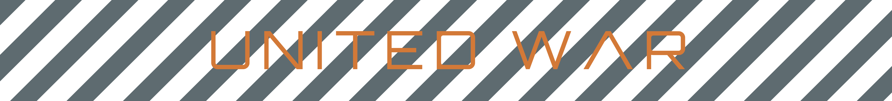
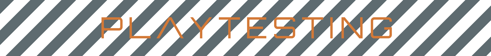
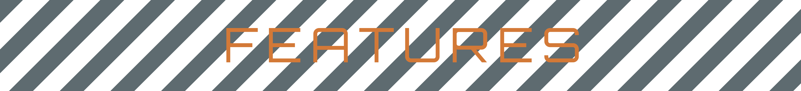

<br>

<!-- DESCRIPTION -->
<p align="center">
  
  <br>
  <!---->
</p>

<h6 align="center">This mod is still a work-in-progress. Contents of this repository are subject to change.</h6>
<br>

<!-- WORKSHOP -->
<p align="center">
  <a href="https://steamcommunity.com/sharedfiles/filedetails/?id=3036741607"></a>
</p>

<!-- STATS -->
<p align="center">
    <a href="https://steamcommunity.com/sharedfiles/filedetails/?id=3036741607"></a>
    <a href="https://steamcommunity.com/sharedfiles/filedetails/?id=3036741607"></a>
    <a href='https://github.com/LordBramster/BZCC-United-War-Mod/releases'>
    <!--
    <a href="#"></a>
    <a href="#"></a>
    <a href='https://github.com/LordBramster/BZCC-United-War-Mod/releases'>
    -->
    <br>
</p>

> ***Following the events of BATTLEZONE 2, the UNITED WAR story begins many years after the end of the Human-Scion War. By 2097, the INTERNATIONAL SPACE DEFENSE FORCE was disbanded; an all new peacekeeping force known as the UNITED DEFENSE FORCE, safeguards the new "solar frontier". RACHAEL MANSON (Science Officer), a descendant of a decorated veteran who served in the Human-Scion War, plays a pivotal role in an important discovery within the Elysium System. Elysium, a once abandoned planet during the Biometal-War, emerges as a hub for recent xeno-biology and scientific inquiry in the ever-expanding "solar frontier". Now industrialized by the RESEARCH-DRILLING-AND-SPACE-AUTHORITY, the Elysium System holds the possible key to humanity’s survival: an all new strain of Biometal…***

<br>

<!-- CONTRIBUTION -->
| Contributors | Focus |
| --- | --- |
| `Cygnus-X1` | 3D Models, Textures |
| `Katherlyn` | 3D Models |
| `F9Bomber` | Scripting/Programming |
| `JJ173` | Scripting/Programming |
| `Trosper3` | Scripting/Programming |
| `Shock` | Art, Promotional Content |
| `Feign` | Art, Promotional Content |
| `Jack Forsythe` | Weapons, ODFs |
| `GrizzlyOne95` | Weapons, ODFs |
| `General Black Dragon` | UI/Interfaces, FX |

<!-- SPECIAL THANKS -->
| Special Thanks | To |
| --- | --- |
| `BZSphinx` | 3D Modelling Help |
| `BlueBanana` | Playtesting, Heightmapping Help |
| `VTrider` | Playtesting |
| `Lamper` | Playtesting |
| `HVivify` | Playtesting |
| `Vacuum34` | Playtesting |
| `Trosper3` | Playtesting |
| `BlackDog` | Playtesting |

<br>

<!-- STRIPES -->
<p align="center">
  
</p>

```
Do not use the mod assets as part of your creations or re-upload any creations from this mod.
```

<h2>Instructions</h2>

<h3>Steam Workshop:</h3>

- Subscribe to the `public playtest` version on the Steam Workshop: <a href="https://steamcommunity.com/sharedfiles/filedetails/?id=3036741607"></a>
- Start `Battlezone: Combat Commander`.
- Disable any active **config** mods.
- Disable any active **addon** mods.
- Activate the `United War Public Playtest` mod in the **config** selection menu.
- Play!

<h3>GitHub:</h3>

- Download the latest release `.zip` located [here](https://github.com/LordBramster/BZCC-United-War-Mod/archive/refs/heads/prod.zip).
- Extract the `.zip` contents to your addon directory here: `C:\Users\...\Documents\My Games\Battlezone Combat Commander\addon\`.
- Get at it!

> Thanks to all of those who played, and continue to help contribute by testing the mod!

<br>

<!-- STRIPES -->
<p align="center">
  
</p>

<!-- YOUTUBE -->
<h2 align="center"> Teaser Videos</h2>
<p align="center">
    <a href="https://youtu.be/EVa0s_1YSXY">
        
    </a>
    <a href="https://youtu.be/Gg-AC4nS0YA">
        
    </a>
</p>

<br>

<!-- FEATURES -->
<!--
<p align="center">
  
</p>

- Coming soon.
-->


<!-- STRIPES -->
<!--
<p align="center">
  
</p>
-->

<!--
https://github.com/chroline/well_app#readme\
https://github.com/CCOSTAN/Home-AssistantConfig#readme
-->

<!--
<h1 align="center">
  <a name="logo" href="#"></a>
  <br>
  United War BATTLEZONE
</h1>
<br>
-->

<!--
|  |
| :----------------------------------------: |
|      **Figure 1.** _This is a caption_     |
-->
